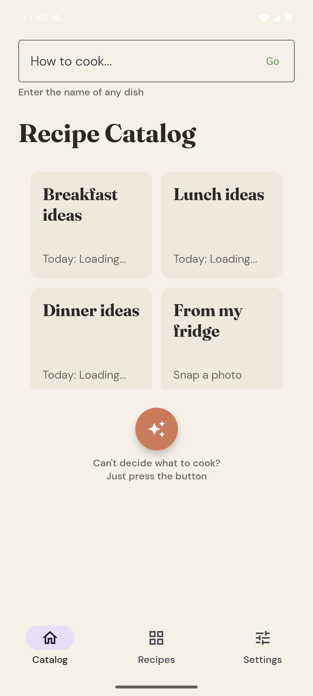
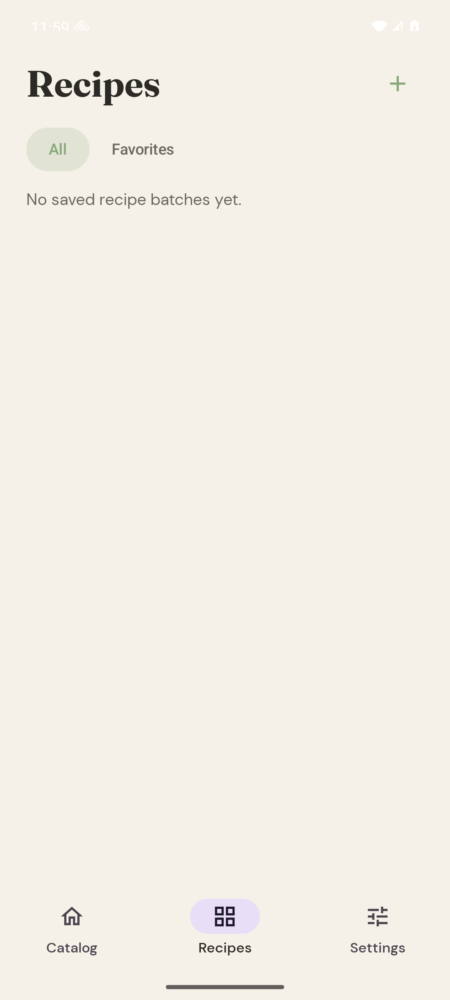
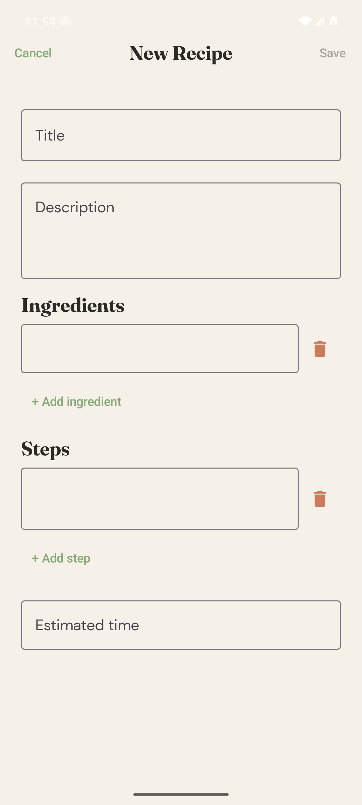
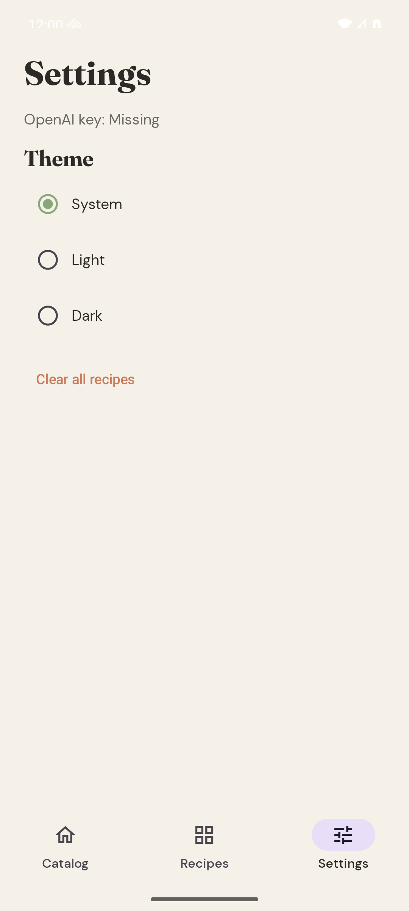

# FridgeChef Android

Native Android port of FridgeChef: a local-first recipe assistant that turns dish names, meal ideas, fridge photos, and manually saved recipes into a personal cookbook.

The app is based on the iOS cross-platform contract in `recipe-ingredients-ios/docs/CROSS_PLATFORM_SPEC.md`, then extended with Cookbook Phase 1: create recipes, edit recipes, favorite recipes, filter favorites, and delete recipes or batches.

## Screenshots

| Catalog | Recipes |
|---|---|
|  |  |

| Create Recipe | Settings |
|---|---|
|  |  |

## Features

- Generate three recipe ideas from a typed dish name
- Generate breakfast, lunch, or dinner ideas from catalog cards
- Pick a fridge/pantry photo and generate recipes from visible ingredients
- Surprise mode for random meal and style combinations
- Daily meal-card picks cached per calendar day
- Save generated batches locally
- Create a custom recipe manually
- Edit generated or user-created recipes
- Favorite recipes and filter the Recipes tab to favorites
- Delete individual recipes or full batches
- Switch between system, light, and dark themes

## Stack

- Kotlin + Jetpack Compose
- MVVM with `StateFlow`
- Local SQLite persistence using the portable schema from the iOS spec
- SharedPreferences for theme and daily-pick cache
- Direct OpenAI Chat Completions calls with strict JSON-schema responses
- Compose UI tests for cookbook flows

## Setup

Create `local.properties` in the repo root. This file is ignored by git:

```properties
OPENAI_API_KEY=<your-openai-api-key>
```

Build the debug app:

```bash
./gradlew :app:assembleDebug
```

The API key is read into `BuildConfig.OPENAI_API_KEY` and is ignored by git.

## Tests

Run JVM tests and build the app:

```bash
GRADLE_USER_HOME=/private/tmp/gradlehome ./gradlew testDebugUnitTest assembleDebug
```

Run connected emulator UI tests:

```bash
GRADLE_USER_HOME=/private/tmp/gradlehome ./gradlew connectedDebugAndroidTest
```

Current verified status:

- `testDebugUnitTest assembleDebug`: passing
- `connectedDebugAndroidTest`: 2 tests passing on `Pixel_8_API_36`

## GitHub

- Android repo: https://github.com/ZeekrBaha/recipe-ingredients-android
- iOS reference repo: https://github.com/ZeekrBaha/fridgechef-ios
